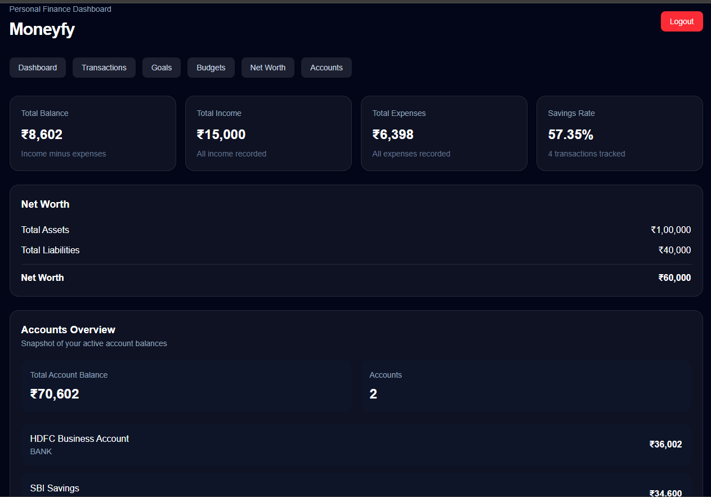
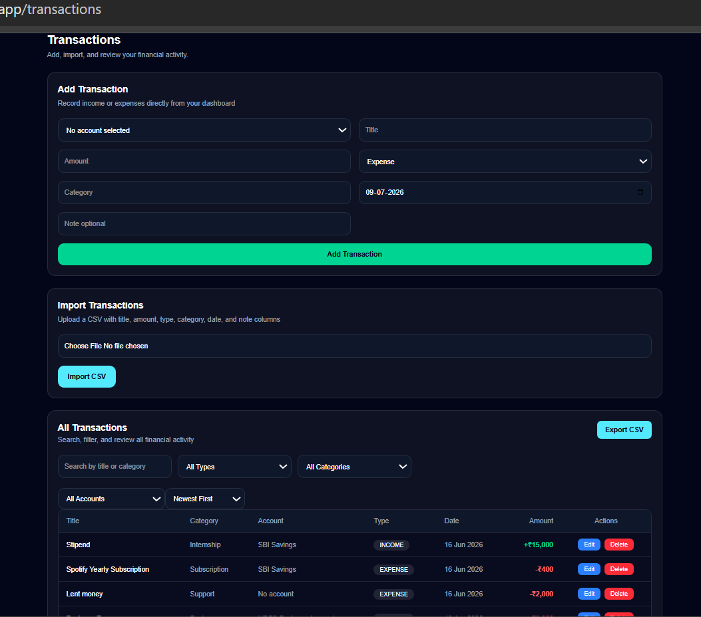
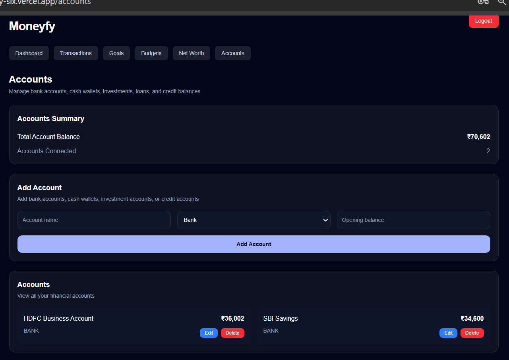
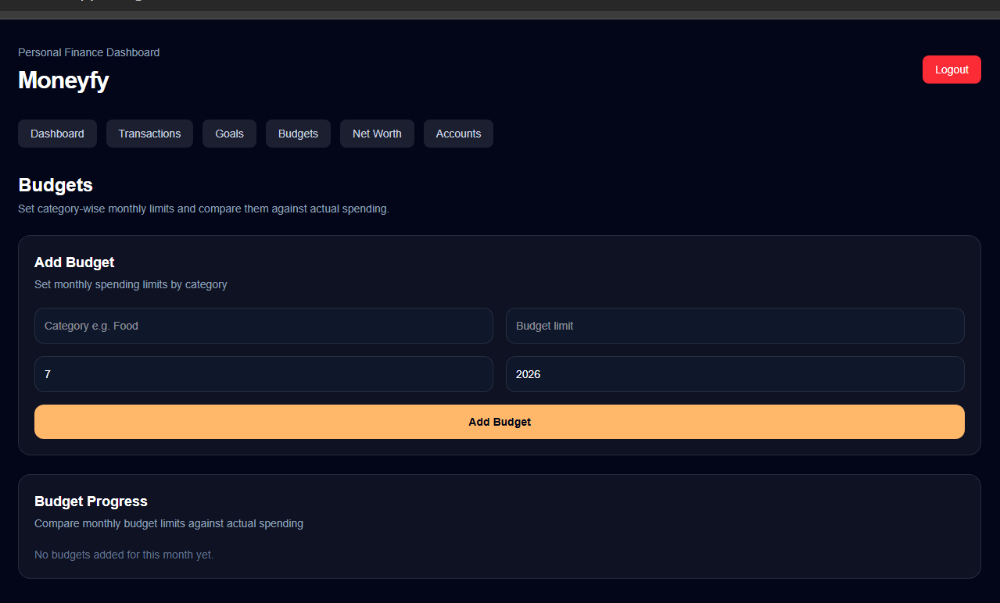
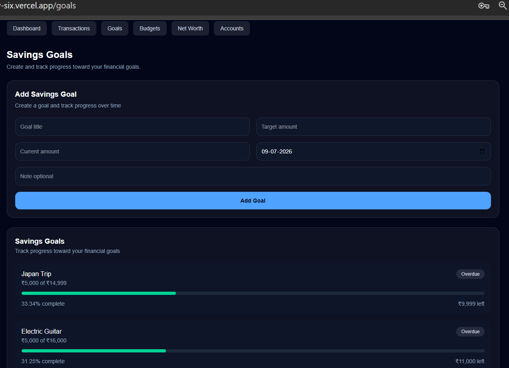
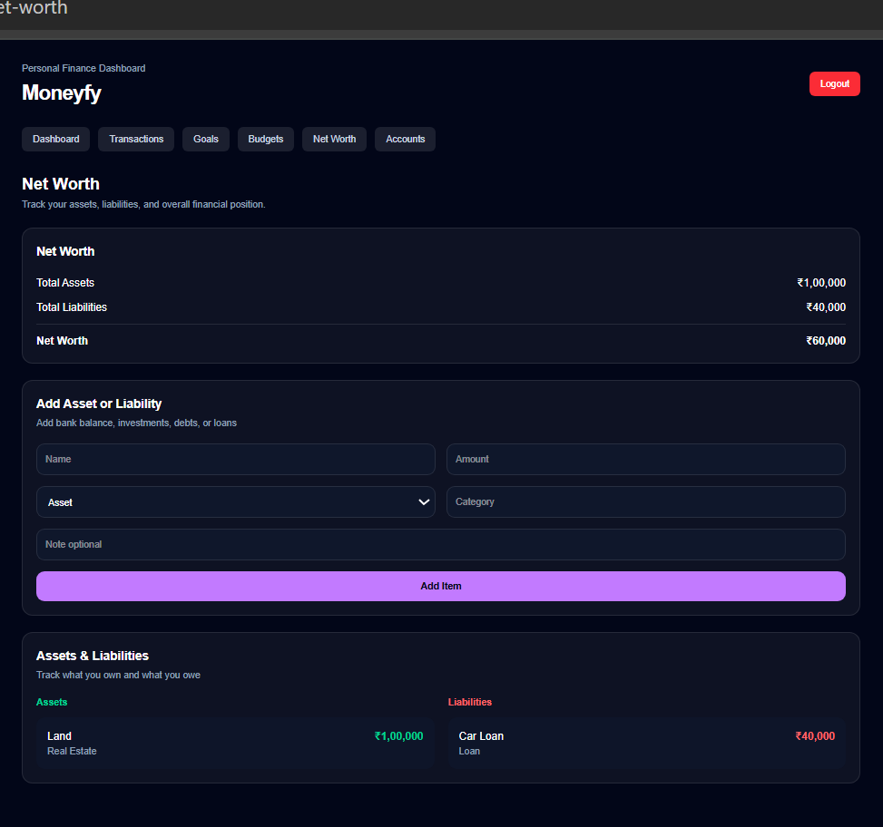
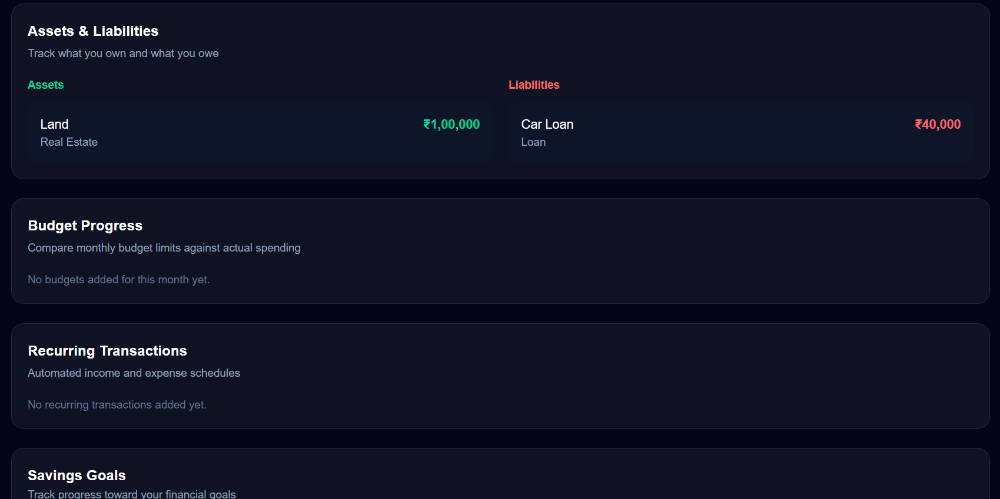
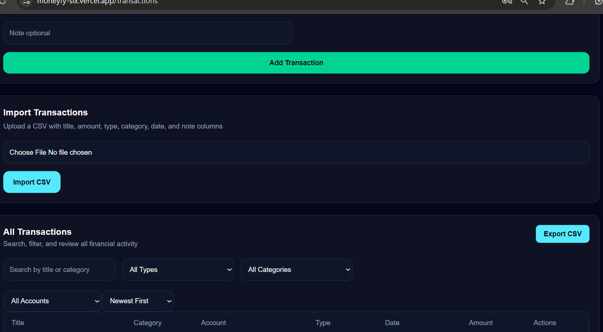

# Moneyfy

A modern full-stack personal finance management platform that helps users track transactions, manage accounts, monitor budgets, achieve savings goals, and visualize their overall financial health.

Built with **Next.js**, **NestJS**, **PostgreSQL**, **Prisma**, **Redis**, and **BullMQ**, Moneyfy demonstrates production-grade backend architecture, secure authentication, cloud deployment, and scalable financial workflows.

---


## Live Demo

**Frontend:** https://moneyfy-six.vercel.app/

**Backend API:** https://moneyfy-backend-71fc.onrender.com

---

# Dashboard Preview

<p align="center">
  
</p>

---

# Features

### Authentication

* Secure JWT Authentication
* User Registration & Login
* Protected Routes
* Password Hashing with bcrypt

---

### Transaction Management

* Create, update and delete transactions
* Income & expense tracking
* Search
* Sorting
* Pagination
* Category management
* Transaction notes
* CSV Import
* CSV Export

<p align="center">
  
</p>

---

### Account Management

* Multiple financial accounts
* Automatic balance reconciliation
* Account-wise transaction tracking
* Account summary dashboard

<p align="center">
  
</p>

---

### Budget Management

* Create monthly budgets
* Budget utilization tracking
* Progress indicators
* Budget analytics

<p align="center">
  
</p>

---

### Savings Goals

* Financial goal creation
* Target tracking
* Progress visualization

<p align="center">
  
</p>

---

### Net Worth

* Asset tracking
* Liability tracking
* Net worth calculation

<p align="center">
  
</p>

---

### Recurring Transactions

* Recurring income & expenses
* BullMQ background jobs
* Redis-powered scheduling
* Automatic transaction generation

<p align="center">
  
</p>

---

### CSV Support

* Import transaction history
* Export filtered transactions
* Bulk financial data management

<p align="center">
  
</p>

---

# Tech Stack

## Frontend

* Next.js
* React
* TypeScript
* Tailwind CSS

## Backend

* NestJS
* Node.js
* REST APIs
* JWT Authentication

## Database

* PostgreSQL
* Prisma ORM

## Background Processing

* Redis
* BullMQ

## Deployment

* Vercel
* Render
* Neon PostgreSQL
* Upstash Redis

## Infrastructure

* Docker
* Docker Compose

---

# System Architecture

```text
                Next.js Frontend
                       │
                REST API Requests
                       │
                 NestJS Backend
                       │
     ┌─────────────────┼──────────────────┐
     │                 │                  │
 PostgreSQL         BullMQ             JWT Auth
   (Prisma)            │
                       │
                    Redis
```

---

# Project Structure

```text
Moneyfy
│
├── client/
│   ├── src/
│   ├── public/
│   └── ...
│
├── server/
│   ├── src/
│   ├── prisma/
│   └── ...
│
└── docker-compose.yml
```

---

# Local Setup

Clone the repository

```bash
git clone https://github.com/Pranaycantcode/moneyfy.git
```

Install dependencies

```bash
cd client
npm install

cd ../server
npm install
```

Configure environment variables

```env
DATABASE_URL=
JWT_SECRET=
JWT_EXPIRES_IN=
REDIS_HOST=
REDIS_PORT=
```

Run the backend

```bash
npm run start:dev
```

Run the frontend

```bash
npm run dev
```

---

# Docker

Build and run the complete application

```bash
docker compose up --build
```

---

# What I Learned

Building Moneyfy provided hands-on experience with:

* Designing modular backend architecture using NestJS
* Implementing JWT authentication and authorization
* Database modeling with Prisma ORM and PostgreSQL
* Background job processing using BullMQ and Redis
* Dockerizing multi-service applications
* Deploying production applications using Vercel, Render, Neon, and Upstash
* Debugging real-world deployment issues including Docker builds, Prisma migrations, environment configuration, and CORS

---

# Future Improvements

* Unit & Integration Testing
* GitHub Actions CI/CD
* PDF Financial Reports
* Email Summaries
* Advanced Financial Insights
* Multi-currency Support

---

# Author

**Pranay Mishra**

GitHub: https://github.com/Pranaycantcode

LinkedIn: https://www.linkedin.com/in/pranay--mishra/
